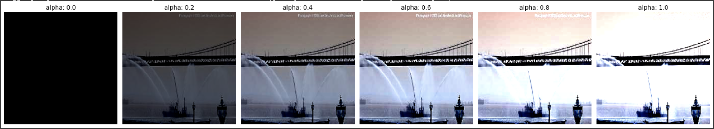
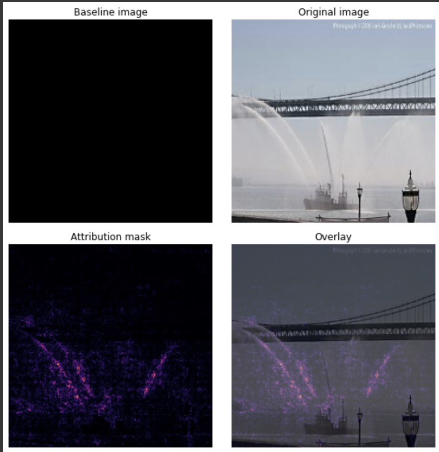
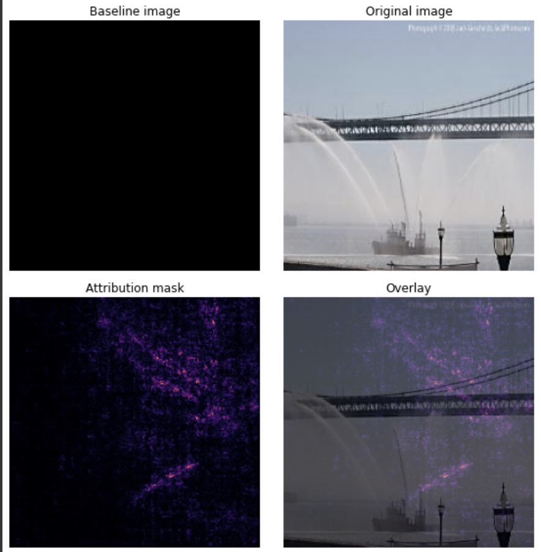

# AMMI_BootCamp_Week_1
This repository contains all jobs for week 1 of bootcamp. The main paper is <a href= 'https://arxiv.org/pdf/1703.01365.pdf'> Axiomatic Attribution for Deep Networks </a>.

The main idea behind this paper is to identify how much an inputs feature (pixels, for example) contribute to the prediction of a given input data (image for example). This is very important for the model interpretability. The method that we use is <b> Integrated gradient</b>.

The original image is:

The interpolated images are:

The experimentations gives us:

<h1>Integrated Gradient method</h1>

<h2>gradient method result</h2>

   
In <a href= 'https://arxiv.org/pdf/1703.01365.pdf'> Axiomatic Attribution for Deep Networks </a>, the implementations were done on:
<ol>
  <li> <b> An Object Recognition Network </b> </li>
  <li> <b> Diabetic Retinopathy Prediction </b> </li>
  <li> <b> Question Classification </b> </li>
  <li> <b> Neural Machine Translation </b> </li>
  <li> <b> Chemistry Models </b> </li> 
</ol>

Whereas, up to now my experimentations stay on <b> An Object Recognition Network </b>. I keep working on all these use cases.

